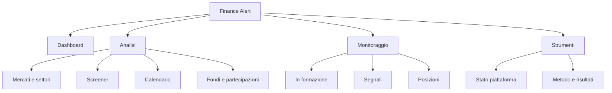

# Finance Alert — audit frontend, UI/UX e architettura informativa

Data: 10 settembre 2026
Codice: branch `cloud`, HEAD `bd9f82f`
Evidenza visiva: 426 PNG, 17 route × 3 viewport (1440×1000, 768×1024, 390×844)

Questo documento **sostituisce** i due precedenti e va letto al loro posto:

| Sostituito | Autore | Cosa ha portato |
|---|---|---|
| `frontend-ui-review-2026-09-10.md` | Claude | cause misurate nel codice per i difetti di layout, correlazioni fra oggetti già in payload |
| `frontend-ui-ux-architecture-audit-2026-09-10.md` | GPT Astra 6 | i difetti di **correttezza dei dati**, la classificazione dell'evidenza, i contratti di dominio, l'architettura informativa |

I due si correggono a vicenda in tre punti, e le correzioni sono in §2.3. Nessun
rilievo compare due volte: dove entrambi dicevano la stessa cosa, resta
l'enunciato più preciso e la fonte è indicata solo se cambia il peso.

---

## 1. Il risultato

**I difetti gravi di questa applicazione non sono di layout, sono di
significato dei numeri.** Sei valori mostrati a schermo sono sbagliati o
ambigui in modo che orienta una decisione, e tre di essi lo sono in misura
grande: un fattore 1000, un fattore 100 e un minimo del 1932 etichettato come
minimo annuale.

I problemi di leggibilità esistono e sono reali, ma un titolo troncato si
riconosce; un numero sbagliato con l'unità sbagliata accanto no. L'ordine di
questo documento riflette quella priorità e non l'ordine in cui i difetti
saltano all'occhio.

La seconda conclusione riguarda il metodo del progetto, non il progetto: **le
regole di onestà che questo repository applica ai propri numeri non sono
applicate alle proprie unità di misura.** CLAUDE.md pretende che un tasso porti
il denominatore e che un intervallo sia dimensionato sulle finestre
indipendenti; nel frattempo una variazione di quote viene stampata con l'unità
dei punti percentuali, e un livello in migliaia con un suffisso che ne aggiunge
altre tre cifre. La disciplina c'è, è applicata alla statistica e non
all'aritmetica.

---

## 2. Metodo

### 2.1 Classificazione dell'evidenza

Adottata dal documento Astra, perché distingue quello che si sa da quello che
si suppone:

- **Confermato** — discrepanza visibile a schermo *e* un percorso di codice a
  HEAD che la spiega.
- **Osservato** — visibile nello screenshot; l'origine non è stata verificata.
- **Da verificare** — ipotesi da riprodurre con dati, API o interazione.
- **Proposta** — nuova organizzazione o capacità, non un difetto.

Ogni riscontro "Confermato" in §3 è stato riletto sul codice a `bd9f82f`, non
al commit `0b4cf30` su cui l'audit Astra era stato scritto: quel commit è **19
commit dietro HEAD** e in mezzo sono atterrate cinque feature che toccano
proprio le aree in esame. Le voci rese obsolete sono elencate in §2.4.

⚠️ **Limite dichiarato: la verifica avversariale non è stata eseguita.** Il
piano prevedeva, per ogni conferma, un secondo agente incaricato di smentirla.
Quella fase si è interrotta per esaurimento del budget. Le conferme di §3 sono
quindi a **voto singolo**. Non le declasso, perché ognuna cita file e riga
ricontrollabili in un minuto, ma chi le userà per aprire un intervento faccia
il controllo che la §3 indica sotto ogni voce.

### 2.2 Copertura e limiti dell'acquisizione

- `fullPage` non espande il contenitore `main` scrollabile dell'app: molti file
  `--full` hanno solo l'altezza del viewport.
- Gli scatti `--internal` campionano inizio/centro/fondo e sinistra/destra di
  ogni contenitore: **sono campioni, non una scansione continua**.
- Un titolo (DG), un settore (Financials), un indice (^GSPC), una serie macro
  (PAYEMS), un fondo (Vanguard). Non tutti i ticker né tutti i periodi.
- Mancano prove sistematiche di: tema scuro, focus, tastiera, screen reader,
  touch su hardware reale, dialog aperti, stati di errore e di assenza dati.
- Screenshot statici non misurano INP e non sostituiscono il RUM.

### 2.3 Tre correzioni fra i due documenti

Vanno prima di tutto il resto, perché due riguardano affermazioni che erano nel
report Claude e sono **false**.

**a) Il conteggio dei contenitori annidati era sbagliato, e con esso il titolo
del report Claude.** Quel documento apriva con *"il desktop è il viewport
peggiore dell'app"*, sostenuto da "35 contenitori con scorrimento interno sulla
dashboard desktop contro 9 su mobile". Erano **scatti**, non contenitori — cioè
esattamente l'artefatto di cattura che il documento Astra aveva descritto in
§2. Contando i contenitori distinti:

| | Desktop | Tablet | Mobile |
|---|---:|---:|---:|
| Dashboard | 9 | 4 | 4 |
| Dettaglio titolo | 7 | 1 | 2 |
| Impostazioni | 1 | 7 | **10** |
| **Totale, 16 pagine** | **35** | **31** | **39** |

Il desktop è il peggiore su **2** pagine; il mobile su **4**. La tesi generale
è falsa. Quello che sopravvive è più stretto e resta utile: sulle due pagine
più dense — dashboard e dettaglio titolo — il desktop annida da due a sette
volte più del mobile, e sono le due pagine che contano di più. Il numero 35 che
mi aveva convinto era il totale desktop di tutte le pagine, coinciso per caso
col conteggio scatti di una sola.

**b) "Sei pagine di dettaglio senza via di ritorno" era un'esagerazione.** Ne
hanno una tre su cinque: `SectorDetailPage`, `MacroDetailPage` ("← Indietro"),
`InstitutionalDetailPage` ("← Tutti i portafogli"), più la 404. Mancano in
`StockDetailPage` e `MarketDetailPage`. Astra aveva ragione — *"back link già
presenti in diversi dettagli"* — e il rilievo corretto è più forte, non più
debole: **il ritorno manca esattamente sulla pagina più visitata dell'app.**

**c) I tre conteggi divergenti NON sono un difetto.** Astra segnalava come
*da verificare* che la Dashboard dica 1002 titoli, lo Screener 949 ed Esplora
925. La verifica dice che contano tre popolazioni diverse, per scelta
documentata nel codice:

- **1002** = titoli con `has_full_data` (≥ 200 barre, soglia per una EMA200
  significativa), su **tutto** il catalogo ETF inclusi. Il docstring di
  `market_stats_service` lo dichiara: la breadth globale vede tutti i titoli
  perché *"CN/JP/KR stocks contribute to breadth — that's the whole reason
  they're in the catalog"*.
- **949** = risultati **con i filtri attuali**, e la pagina lo scrive accanto
  al numero.
- **925** = universo azionario delle aggregazioni settoriali, che escludono gli
  ETF.

Forzarli all'uguaglianza romperebbe tre scelte corrette. Quello che manca è
solo che ogni aggregato dichiari il proprio perimetro — vedi §7.

### 2.4 Rilievi Astra già risolti fra `0b4cf30` e HEAD

| Rilievo | Risolto da |
|---|---|
| Valuta degli alert prezzo (UX-063) | `db219c1` — etichetta e chip nella valuta di quotazione |
| Unità/valuta sul dettaglio titolo (UX-040 parziale) | `db219c1` — `lib/money.ts`, 26 punti convertiti |
| Recupero dello zoom sul grafico (UX-039) | `ddf3795` — comando in toolbar, stessa finestra dell'avvio |
| Timeframe persistente (UX-037) | `ddf3795` — con l'URL che ha la precedenza |
| Preset screener con colonne e ordinamento (UX-016) | `f88a8d5` |
| Statistiche esiti sui setup (UX-030 parziale) | `3a6ee82` |

⚠️ La valuta è risolta **sul dettaglio titolo e nello screener**, non ovunque:
dashboard, playbook degli alert e ricerca in barra hanno ancora il dollaro
cablato.

---

## 3. Correttezza dei dati

Sei difetti, in ordine di danno. Tutti **Confermati** salvo dove indicato.

### 3.1 «52 settimane» è l'intera storia — su 5 timeframe su 6

**Cosa si vede.** Su `/markets/^GSPC`: `52W HIGH 7799` e `RANGE HIGH 7799`,
`52W LOW 4.40` e `RANGE LOW 4.40`. Due riquadri etichettati diversamente
mostrano **lo stesso numero**. Con `Bar nel chart 24.789`, il "range attivo" è
la serie dal 1927; 4.40 è il minimo del 1932.

**La causa.** `market_detail_service.py:198` sceglie il ramo con
`if range_key in ("1m", "3m", "6m")`. Quella lista è il vocabolario
**precedente** a `2faee27` ("feat(charts): timeframe vocabulary") e non è mai
stata aggiornata. Il selettore offre oggi `5m/30m/1h/1d/1w/1m`, quindi:

| Timeframe | Cosa produce come «52W» |
|---|---|
| 5m, 30m | estremi degli ultimi 60 giorni |
| 1h | estremi di 730 giorni |
| **1d** (default) | `period="max"` → **intera storia** |
| 1w | intera storia |
| 1m | 1 anno — **corretto** |

L'unico timeframe giusto è quello pescato per caso dalla lista legacy. Il
ramo `else` (righe 219-222) assegna letteralmente `high_52w = high_window`.

**Due aggravanti.** Il calcolo usa solo le **chiusure** (`closes = [b.close …]`);
gli high/low di barra vengono scaricati e mai usati, e l'etichetta a schermo non
lo dice — `KpiCell` non ha nemmeno uno slot per un tooltip. La scheda titolo
invece lo dichiara (`MicroDataCard`: *"basato sulle chiusure giornaliere"*).
E **nessun test copre il blocco**: `tests/test_market_detail_service.py` non ha
una sola asserzione sui 52W, quindi la regressione è invisibile da `2faee27` in
poi.

**La metà pericolosa non è il 4.40.** Un minimo dell'S&P 500 a 4.40 si
autodenuncia. Un minimo a 60 giorni o a 2 anni etichettato «52W» su un
qualsiasi altro simbolo è **plausibile**, e quindi viene creduto.

> Controllo da un minuto, senza rete: aprire `/markets/^GSPC` sul default e
> guardare se «52W low» e «Range low» mostrano lo stesso numero. Poi cliccare
> «1m»: è l'unico che deve cambiare.

### 3.2 Il macro sbaglia la scala di mille volte

**Cosa si vede.** Su `/macro/3` (US Non-Farm Payrolls): `ATTUALE 159.1K`,
`PRECEDENTE 158.9K`, `ULTIMA RELEASE 1 ago 26 (Ago)`. La scheda "Cos'è questo
indicatore" dice, testualmente, **`Total Non-Farm Payrolls (thousands)`**.

**Il difetto.** Il valore è già in migliaia: 159.100 migliaia, cioè 159,1
milioni di occupati. Il formatter applica il suffisso `K` a un numero che le
migliaia le ha già, e stampa «159.1K» = 159.100. **L'unità è nel payload e il
formatter la ignora.**

**Il secondo difetto, sullo stesso schermo.** Il grafico «Storico release» su 5
anni disegna ~60 barre partendo da zero, tutte della stessa altezza. È un
**livello** rappresentato come barre: la domanda che si fa a NFP è quanti posti
sono stati creati nel mese, cioè la **variazione**, che vale ~150K contro un
livello di 159.100K — un millesimo dell'altezza della barra. Il grafico disegna
la grandezza sbagliata, e per questo non mostra niente.

**Il terzo.** «1 ago 26» per il dato di agosto: NFP di agosto si pubblica a
inizio settembre. La data di pubblicazione è costruita da
`MacroObservation.date`, che è il **periodo osservato**. Periodo, pubblicazione
e acquisizione sono tre campi distinti e qui sono uno solo.

### 3.3 Una variazione di peso superiore a 100 punti percentuali è impossibile

**Cosa si vede.** Sul dettaglio titolo, pannello «Posizioni per istituzione»,
con l'intestazione *"barra = peso nel portafoglio del fondo"*:

| Fondo | Variazione mostrata | Peso |
|---|---|---|
| Balyasny Asset | **+7663.7PP** | 0.2% |
| Citadel Advisors | **+462.6PP** | 0.1% |
| Millennium Management | **+107.6PP** | 0.1% |

**L'argomento non richiede di leggere il codice.** Un peso di portafoglio vive
fra 0% e 100%, quindi la sua variazione in punti percentuali non può superare
100 in valore assoluto. Ce ne sono **tre** sopra quella soglia sullo stesso
schermo.

**La causa.** `institutional_service.py` calcola la variazione percentuale
delle **quote**; `InstitutionalHoldersCard` la passa a `AllocationBars.deltaPct`,
che è definita e formattata come variazione del **peso in punti percentuali**.
Balyasny ha moltiplicato le quote per ~77 volte: +7663,7% di azioni, non punti.

**Invariante da mettere in un test:** `|Δpp| ≤ 100`, sempre. E le due misure
vanno separate nello schema: `shares_change_pct` e `portfolio_weight_delta_pp`
non sono la stessa colonna.

### 3.4 Quattro prezzi base diversi per lo stesso titolo, nessuno dichiarato

**Cosa si vede.** Sulla pagina di DG, lo stesso target analisti rende
**+11.5%** in una scheda e **+4.3%** in un'altra. L'aritmetica lo conferma da
sola: 138,93 / 124,57 = +11,5%; 138,93 / 133,21 = +4,3%.

**Le quattro basi**, tutte sulla stessa pagina:

| Scheda | Prezzo base | Origine |
|---|---|---|
| Header | prezzo **live** (cache 10s, polling 15s), fallback ultima barra | `useLiveQuote` |
| Pannello analisti | `pt.current` da yfinance, età pari alla cache fondamentali | `_extract_price_target` |
| Scheda punteggio | ultima `OhlcvDaily.close` | `quality_extras`, backend |
| Fattore valutazione | una quarta base ancora | `pillars.py` |

Nessuna delle quattro dichiara quale prezzo sta usando né a che ora. La scheda
analisti mostrava «aggiornato 4g fa»: un target confrontato con un prezzo di
quattro giorni prima, accanto a un prezzo live.

### 3.5 Il market cap mescola valute su una colonna ordinabile

Già a backlog come **FA-026**. Gli screenshot lo rendono più grave dell'enunciato
originale: **le due valute stanno sulla stessa riga**.

| Titolo | Prezzo | Mkt cap |
|---|---|---|
| 0001.HK CK Hutchison | HK$70.20 | **$267.5B** |
| 0005.HK HSBC | HK$165.60 | **$2.86T** |

`stock.market_cap` è nella valuta di quotazione. Con quella cifra HSBC sarebbe
la società più capitalizzata al mondo, e **la colonna si ordina**: non è
un'etichetta sbagliata, è una classifica sbagliata. `risk.py` ha già pagato lo
stesso difetto — il suo test registra 158 nomi sopra la soglia mega-cap in
valuta nativa contro 83 in dollari, cioè 75 titoli classificati mega-cap senza
esserlo — e lì è stato risolto con `to_usd`.

Resta una **decisione**: convertire tiene l'ordinamento sensato e cambia i
numeri a schermo; etichettare ogni cap con la sua valuta è onesto e rende
l'ordinamento privo di senso. La prima è quasi certamente giusta perché la
colonna esiste *per* ordinare.

### 3.6 Il flag che esclude gli ETF è corretto e i suoi dati sono congelati

**Cosa si vede.** Il settore Financials include QQQ.

**Il filtro non è il problema: è capillare.** In `api/sectors.py` **ogni** query
porta `.where(Stock.instrument_type == "equity")` — rollup settoriale, tecnico,
trend, segnali, industrie, tile e dettaglio. I commenti citano il caso per
nome: *"ETF/ETN rows carry a sector label (SPY sat in Financials) but no
meaningful fundamentals"*.

**Il problema è il flag.** `instrument_type` è scritto **una sola volta**, da
una migration con lista hard-coded di 24 ticker, raccolti come *"exactly the
NYSE Arca listings"* il 2026-07-04. QQQ è quotato NASDAQ e non c'è; ci sono
SQQQ e TQQQ perché quelli sono su NYSE Arca. E **nessun percorso di ingestione
lo valorizza**: né `seed_service` né `catalog_refresh_service` lo impostano,
quindi ogni riga nuova nasce `equity`.

Sul DB: **975 `equity` / 24 `etf`**, esattamente i 24 della migration, mai
cresciuti. QQQ passa il filtro e atterra in Financials perché i seed degli ETF
assegnano «Financial Services», che il normalizzatore mappa su FINANCIALS.

**Il rilievo giusto non è «QQQ è nel settore sbagliato», è: la
classificazione degli strumenti è ferma a una fotografia di luglio.** Ogni ETF
aggiunto dopo quella data è invisibile a sette query.

---

## 4. Leggibilità e layout

### 4.1 Il dettaglio titolo perde titoli e valori a 1440px

**Cosa si vede.** `Profittabilità Sostenib`**`45`**`lità` — il valore è disegnato
**sopra** la parola, non troncato accanto. Idem `Crescita Valore`**`71`**.
Schede intitolate `F`, `VALUATION…`, `ANAL…`, e una il cui titolo visibile è il
frammento `10) yfinance · cache 1h`.

**La causa è aritmetica.** A 1440px la colonna contenuto è 1136px
(1440 − 256 sidebar − 48 padding). `StockDetailPage.tsx:281` divide in
`[2fr_1fr]` e spezza poi il `1fr` destro in due con `sm:grid-cols-2`:

```
1136 − 12 gap = 1124  →  hero 749px  |  colonna destra 375px
375 − 12 gap  = 363   →  due schede da ~181px
181 − 48 padding      →  ~133px di contenuto utile
```

Centotrentatré pixel non contengono «Sostenibilità» più un numero allineato a
destra. La riga in basso (`:344`) fa lo stesso con `[1.5fr_1fr_1fr_1fr]`: tre
schede da 244px, da cui `F` e `ANAL…`. E porta `lg:h-[520px]`, un'altezza
**fissa**, che impone scorrimento interno a tutte e quattro comunque.

**Il rimedio esiste già nell'app.** A 390px la stessa scheda rende
`CONSERVATIVE` per intero e i cinque pilastri come **barre etichettate col
valore** — Profittabilità 43, Sostenibilità 67, Crescita 71, Valore 70,
Sentiment 61, con Profittabilità in ambra perché è la più bassa. È una lettura
migliore di quella desktop sotto ogni aspetto. Basta impilare le due schede a
`lg` invece di affiancarle: da 181px a 375px.

### 4.2 Le holdings di un fondo non hanno alcun limite, a nessuno dei tre strati

- Frontend: `visibleHoldings.map` sull'intero array, nessuno `slice`, nessuna
  virtualizzazione, nessun `max-h`. L'unico `.slice(0, 10)` serve al KPI
  «Top-10 weight».
- API: `get_detail` non ha `limit`/`offset` — a differenza di
  `get_ticker_holders` subito sotto, che ha `limit: int = 25`.
- Query: nessun `.limit()`.

Risultato misurato: uno screenshot interno delle holdings supera i **302.900
pixel** di altezza.

**E il divario 4.295 / 5.252 ha un meccanismo esatto**, non è sporcizia nei
dati. L'header legge `InstitutionalFiling.total_positions`, scritto una volta
come `len(filing.holdings)` all'ingest. La tabella conta tutte le righe del
filing. In mezzo, `compute_qoq_deltas` **inserisce righe sintetiche** per le
uscite (`shares=0`, `action="sold_out"`) e **non aggiorna mai
`total_positions`**. Quindi, per costruzione:

```
righe in tabella = total_positions + numero di uscite
5.252 − 4.295 = 957 uscite sintetizzate
```

Entrambi i numeri sono corretti per quello che contano. Manca l'etichetta: uno
è «posizioni riportate», l'altro «righe incluse le uscite».

### 4.3 Il calendario non lascia leggere chi pubblica

Le pastiglie mostrano logo e una lettera: `D ▲`, `P. ▲`, `C ▲`, `A…`, `O…`,
`S…`, `K…`. Su un calendario earnings il ticker **è** l'informazione.

La causa è la disposizione: ogni cella è larga ~140px e ne ospita **due
affiancate**, quindi ciascuna ha ~65px. Una per riga ne avrebbe ~130 e il
ticker entrerebbe. La cella ha altezza abbondante e larghezza scarsa; il
contenuto è disposto nel verso sbagliato. Su mobile il problema si aggrava e
«Oggi» finisce fuori vista.

### 4.4 La barra indici è vuota su desktop e viva sugli altri due viewport

Desktop: sei indici, dodici `n/d`, nella striscia più in alto della pagina più
aperta. Tablet e mobile, **stessa sessione di acquisizione**:
`FUT S&P 500 7649 ↓ -0.44%`. Il componente sa ricadere sui futures a mercati
chiusi e su due viewport su tre lo fa.

Due su tre funzionanti escludono un'indisponibilità della sorgente. **Osservato**:
da riprodurre prima di ipotizzare la causa. Tre righe più sotto, la striscia di
ampiezza dice `USA 54% -0.93% · Europa 58% -1.63%`: due componenti parlano
degli stessi mercati nello stesso schermo, uno vuoto e uno pieno.

### 4.5 Colonne vuote e righe mozzate

Su *In formazione*, `LIVELLO D'INNESCO` e `DISTANZA` mostrano un trattino su
ogni riga visibile: due colonne che occupano larghezza per non dire nulla, su
una tabella che ha già dovuto tagliare `ATTESA` a destra. Una colonna vuota per
tutte le righe del risultato corrente non va renderizzata.

⚠️ Ma un `—` sulla distanza può anche significare **trigger non basato sul
prezzo**. In quel caso la cella deve dire «condizione di volatilità» o «non
applicabile»: è la stessa distinzione fra assenza e zero che il repo applica
altrove.

Nella scheda SEGNALI della dashboard desktop la riga `IFX.DE` è tagliata a metà
altezza: un contenitore ad altezza fissa che non si allinea al passo delle
righe.

### 4.6 Su mobile sparisce l'identità, non la misura

Sulle barre del fondo Vanguard i nomi si comprimono a zero mentre le percentuali
restano; su Esplora e sul dettaglio settore i titoli si troncano. Il dato
diventa inutilizzabile: una barra al 3,5% senza sapere di chi non è
un'informazione parziale, è rumore.

**Regola:** identità e misura sulla stessa unità di lettura. Nessuna colonna
del nome comprimibile a zero.

---

## 5. Struttura dell'app

### 5.1 Due pagine di diagnostica, una delle quali si chiama «Impostazioni»

`/settings` è **62 righe** e monta otto pannelli, tutti diagnostici:
EngineHealth, SignalEffectiveness, Calibration, DetectorPerformance,
EquityCurve, ScoreIc, ScanLog, CatalogRefresh. Il file lo dice di sé —
occhiello *«Amministrazione · diagnostica»*, commento di testata *«Admin /
diagnostic surface»*. Gli unici controlli sono filtri **effimeri** su uno
studio: nessuno persiste, nessuno cambia il comportamento dell'app. L'unica
mutazione è un refresh catalogo, che è un'azione admin.

**Le preferenze vere esistono, sparse**, ognuna incollata alla feature che
serve: `sidebar-collapsed` e il tema in `Layout` (il toggle sta nel footer
della sidebar **accanto** al link Impostazioni, non dentro), `chart-timeframe`
in `chartPrefs`, viste salvate e aree aperte nel filtro screener, colonne in
`useColumnVisibility`.

**Proposta.** Una destinazione `Diagnostica` con due schede — *Piattaforma*
(fonti, processi, catalogo, log) e *Motore* (significato delle metriche, esiti,
studi). Libera l'ingranaggio per le preferenze vere, che oggi non hanno casa.
La separazione ha un senso preciso: **disponibilità del sistema** e **capacità
predittiva del motore** sono due domande diverse e non vanno nella stessa
pagina.

### 5.2 Architettura informativa proposta

Ogni destinazione risponde a una domanda. I gruppi sono etichette di
navigazione, non nuove pagine vuote; le pagine di dettaglio restano oggetti
trasversali raggiungibili da più percorsi.



Preferibile a una fusione in mega-dashboard: consente di tornare al contesto e
di caricare solo le viste necessarie. Una lista mista di setup, segnali e
posizioni perderebbe stati, date e criteri di esito differenti.

⚠️ «Superinvestor» oggi copre anche grandi istituzionali e hedge fund. «Fondi e
partecipazioni» espone il contenuto reale.

### 5.3 Il ritorno manca dove serve di più

Tre pagine di dettaglio su cinque hanno già un ritorno esplicito. Mancano in
**`StockDetailPage`** e **`MarketDetailPage`**. Due pagine hanno anche un
occhiello sopra il titolo che assolve la funzione di breadcrumb — Calendario
(`PIANIFICAZIONE · EVENTI DI MERCATO`) e Impostazioni (`AMMINISTRAZIONE ·
DIAGNOSTICA`). **Il modello esiste già ed è applicato a due pagine su
diciassette**: estenderlo costa meno che progettare un breadcrumb nuovo.

### 5.4 L'URL e l'etichetta non si parlano

`/sectors` è «Esplora», `/stocks` è «Screener», `/institutionals` è
«Superinvestor», `/settings` è «Impostazioni». Quattro destinazioni su dieci
hanno un indirizzo che non nomina la pagina. I link sono condivisibili ma non
**leggibili**. Non è urgente e cambiare le route rompe i segnalibri: va messo
agli atti perché ogni nuova voce peggiora la mappa.

### 5.5 Struttura comune delle pagine

1. Titolo dell'oggetto, contesto di provenienza, azione primaria.
2. Ambito e tempo: filtri, sessione di mercato, data dei dati.
3. Sintesi essenziale, con unità e denominatori.
4. Contenuto operativo principale.
5. Approfondimenti, metodo, fonte.

Il titolo dell'oggetto non deve sparire mentre si leggono numeri. Evitare
contenitori scrollabili annidati per il **testo ordinario**; tabelle e grafici
possono avere scorrimento dedicato con intestazioni leggibili.

---

## 6. Cosa funziona, e va preso a modello

Metà del valore di un audit è non far riscrivere ciò che è a posto.

**Esplora fa già quello che questo documento avrebbe proposto come novità:**

- tre ordinamenti dello stesso universo affiancati (Analisti, Qualità × Tecnico,
  Segnali), così «dove guardare» ha tre risposte confrontabili;
- una didascalia che nega la capacità predittiva: *«Non sono previsioni di
  rendimento: gli studi condotti sul motore non mostrano capacità predittiva
  sui ritorni futuri»*;
- una nota su ciò che manca: *«47 stock senza settore assegnato: contano nel
  totale ma non compaiono qui»*;
- uno scatter che correla due lenti, con bolla dimensionata sul numero di
  titoli e colorata sul saldo segnali;
- la colonna **Divario** = Qualità − Tecnico, l'unica metrica dell'app che mette
  due lenti in relazione invece di affiancarle.

Da non toccare inoltre: **Salute** (banner d'impatto, 19 sorgenti con quote e
ultimo errore testuale, semaforo usato per «rotto» e non per direzione);
**Posizioni** (valute native, totali dichiarati come convertiti); **In
formazione** (quattro tessere su otto mostrano un trattino con la motivazione
accanto — scomodo e corretto); il **marcatore di calibrazione** già presente
sulla cella Probabilità dei segnali; i **KPI tecnici per timeframe** sul
dettaglio mercato, che sono una correlazione multi-orizzonte ben resa.

---

## 7. Correlazioni: informazioni che i dati contengono e lo schermo non mostra

Ordinate per rapporto fra valore e costo. Le prime tre partono da campi già nel
payload.

### 7.1 Una posizione non sa da quale segnale è nata

`Position.alert_id` esiste nel tipo, arriva al frontend, e la pagina Posizioni
**non lo usa** — mentre la sua intestazione promette *«trade tracciati dal piano
operativo dei segnali»*. Costo: un link. Valore: da una posizione aperta si
torna alla regola, alla catena di conferme e alla Forza che l'hanno prodotta.

Simmetricamente `converted_alert_id` collega setup → segnale. Il percorso
completo **setup → segnale → posizione** è già nei dati e non è mai reso.

### 7.2 Entry, stop, target e prezzo sono quattro numeri dove serve una geometria

ARGX.BR: entry 830,80 €, stop 625,52 €, target 1036,08 €, prezzo 865,20 €. Per
sapere quanto manca allo stop bisogna fare la sottrazione a mente su quattro
colonne.

Gli stessi numeri come barra — stop a sinistra, target a destra, entry marcato,
prezzo come cursore — rispondono a colpo d'occhio alla sola domanda che conta su
una posizione aperta: **quanto sono vicino a uscire, e da che parte**. È anche
l'unica parte del playbook con un backtest OOS alle spalle.

⚠️ «Rischio allo stop» è una misura **geometrica** con limiti di esecuzione, non
una perdita massima garantita.

### 7.3 Il Divario Qualità − Tecnico esiste solo per i settori

Esplora lo calcola per gli undici settori (Energy +8,4; Consumer Discretionary
−25,6). Lo screener ha `composite` e `tech_composite` come colonne separate
sulla **stessa riga** e non ne fa la differenza.

Un titolo con Qualità 81 e Tecnico 40 è un oggetto diverso da uno con 81 e 80.
⚠️ Va introdotto come **descrittore, non come segnale**: lo studio score-IC dice
che il composito Qualità non prevede i rendimenti, quindi un Divario alto è una
discrepanza da guardare, non un'occasione. Ed è una differenza fra **indicatori
su scale distinte**, non uno sconto economico.

### 7.4 Il calendario e i setup parlano dello stesso futuro su pagine diverse

*In formazione* dice `ATTESA 13g`. Il calendario sa che quel ticker pubblica fra
5 giorni. Messi vicini rispondono a una domanda che nessuna delle due pagine può
porre da sola: **il setup si risolve prima o dopo la trimestrale?** Una
trimestrale sovrascrive la tesi tecnica. Basta un'icona sulla riga del setup
quando esiste un evento dentro la finestra di attesa.

### 7.5 Una sorgente degradata non lo dice dove il dato viene consumato

Salute sa che *«Fonte fallback non operativa: Marketaux — News»*, con `0/100` di
quota e `HTTP 402`. La scheda News del dettaglio titolo mostra semplicemente
meno articoli. Il degrado è visibile solo a chi va a cercarlo. Una riga sulla
scheda trasforma un'assenza inspiegata in un'assenza spiegata — la stessa
distinzione fra `—` e `0` che il repo applica ai numeri.

⚠️ Attribuire l'impatto **solo dove è tracciabile**: fonte → tipo di dato →
scheda. Non inferire un impatto ticker-specifico che il contratto non supporta.

### 7.6 Le correlazioni che richiedono lavoro, non solo un join

| Domanda | Dati presenti | Cosa manca |
|---|---|---|
| Titolo forte rispetto a quali peer? | settore/industria, score, OHLCV | universo comparabile, calendario e valuta omogenei, copertura dichiarata |
| Quali fondi e titoli condividono partecipazioni? | holdings, periodi, mapping | snapshot comparabili, dedup identità e share class |
| Quanto è concentrata la mia esposizione? | size, lato, valuta, classificazioni | aggregazione FX coerente, lordo/netto distinti |
| Come si muove il titolo intorno agli eventi? | eventi, OHLCV | pubblicazione effettiva, sessione, prezzi rettificati, campione |
| Quali posizioni si muovono in modo simile? | OHLCV, posizioni | rendimenti allineati, finestre e copertura dichiarate |

⚠️ Tutte devono restare **descrittive**. Una correlazione usa rendimenti, non
livelli di prezzo, e mostra finestra, osservazioni comuni e modalità di
conversione. Il prezzo base 100 confronta variazioni; il livello nominale di
titoli in valute diverse non è un confronto di performance.

---

## 8. Contratti da stabilire prima di aggregare

Questa sezione è la risposta strutturale al capitolo 3: i sei difetti di
correttezza sono tutti violazioni di uno di questi contratti.

- **Identità** — ID interno più ticker/exchange/instrument type. Alias e CUSIP
  non risolti non si aggregano per nome approssimato. *(§3.6)*
- **Tempo** — data osservata, pubblicata, acquisita, calcolata, con fuso. Un
  filing trimestrale non diventa «live». *(§3.2, §4.2)*
- **Misura** — nome, unità, valuta, scala, trasformazione, finestra,
  denominatore. Distinguere % da pp, capitalizzazione da valore detenuto,
  livello da variazione. *(§3.2, §3.3, §3.5)*
- **Disponibilità** — valido, assente, non applicabile, stale, errore, copertura
  parziale. `null` non diventa zero. *(§4.5)*
- **Confrontabilità** — stesso periodo e stessa base prezzo/FX; se il requisito
  non è soddisfatto, il confronto **non è disponibile**. *(§3.4)*
- **Versione** — definizione della metrica e del filtro, per gli snapshot
  riaperti in futuro.

**Esempi di accettazione.** Quote da 100 a 120 = **+20% quote**; peso da 2% a
3% = **+1 pp**. Target 138,93 su base 124,57 ≈ +11,5%, su base 133,21 ≈ +4,3%:
la base va mostrata. Un evento di agosto pubblicato a settembre mantiene
entrambi i riferimenti.

---

## 9. Coerenza visiva, accessibilità e architettura frontend

**Gerarchia.** Titolo, valore primario, contesto e dettaglio con ruoli stabili.
Evitare uppercase esteso su frasi e metadati con la stessa evidenza del dato.

**Colori.** La palette semantica del progetto va mantenuta: direzione
(rose/emerald), errore di sistema (red/green), qualità aziendale e stato di
processo hanno significati distinti. Affiancare sempre testo o forma al colore.
⚠️ «Conservative» non è una garanzia di sicurezza dell'investimento.

**Grafici.** Titolo che dice cosa si confronta, unità, intervallo, serie, fonte.
Linee per l'evoluzione, barre per confronti discreti. *(cfr. §3.2: NFP a barre
di livello)*

**Reflow.** Provare anche 320 CSS px e lo zoom. Le tabelle possono richiedere
disposizione bidimensionale; l'eccezione non giustifica titoli e controlli
illeggibili. [W3C — Reflow](https://www.w3.org/WAI/WCAG22/Understanding/reflow.html)

**Touch.** 44px come obiettivo pratico; il requisito WCAG 2.2 AA 2.5.8 è 24×24
CSS px con eccezioni, **non 44px universali**. Verificare area cliccabile e
spaziatura, non la dimensione dell'icona.
[W3C — Target Size](https://www.w3.org/WAI/WCAG22/Understanding/target-size-minimum.html)

**Architettura.** Il codice ha già separazione fra pagine, hook, API e
componenti, lazy per route e query cache. Non emerge ragione per riscrivere il
framework. Da migliorare: un solo modello di navigazione; un contesto di ricerca
tipizzato condiviso; componenti comuni per header entità e dato con unità/età;
aggregazioni batch (`useBookAwareness` è l'esempio da estendere).

**Cancellazione richieste — misurato.** Il client accetta `AbortSignal` e lo
inoltra davvero. Ma nel frontend esistono **due sole** occorrenze di `Abort` in
tutto il sorgente, nessun `AbortController`, e su 58 `queryFn` in produzione
**una** destruttura il `signal` di React Query. Nei moduli `api/`, su 54 wrapper
uno solo espone il parametro: un hook non potrebbe inoltrarlo nemmeno volendo.
Prima di introdurre un secondo client, completare la propagazione qui.

---

## 10. Cosa questo audit NON propone

- **Nessuna watchlist.** Rimossa deliberatamente, come il letto/non letto. Non
  torna senza richiesta esplicita.
- **Nessun sizing sulla Forza.** Il playbook ci ha già provato: la rampa è stata
  rimossa quando il magazzino ha mostrato la banda 90-99 realizzare 42,3% contro
  52-53%. Invertirla ripeterebbe l'errore col segno opposto.
- **Nessun bonus da confluenza sulla Probabilità.** Due studi indipendenti nulli.
- **Nessun ripesaggio dei pilastri.** Lo studio score-IC non mostra IC
  significativo su nessun pilastro.
- **Nessun nuovo punteggio predittivo** costruito su correlazioni o reazioni a
  eventi: restano descrittive.
- **Nessun marcatore di calibrazione sui segnali**: esiste già.
- **Nessun rifacimento della 404**: la schermata è ordinata e ha il ritorno.
- **Nessuna modifica ai periodi fissi degli indicatori**: sono una scelta
  esplicita dell'utente.
- **Nessuna barra di navigazione inferiore su mobile** senza prima verificare i
  percorsi principali: consuma altezza nei grafici.

---

## 11. Rinumerazione e ordine di esecuzione

### 11.1 La collisione degli identificatori

Il documento Astra ha assegnato **FA-022 … FA-056** a 35 pacchetti. Nel backlog
canonico quegli otto numeri iniziali sono **già occupati** da attività diverse,
quattro delle quali chiuse oggi:

| ID | Backlog canonico | Astra intendeva |
|---|---|---|
| FA-022 | Viste salvate screener — DONE | 52 settimane |
| FA-023 | Marker segnali e pan — DONE | shares % vs peso pp |
| FA-024 | Statistiche setup — DONE | unità e date macro |
| FA-025 | Valuta dettaglio titolo — DONE | basi prezzo |
| FA-026 | Market cap in valuta mista — OPEN | responsive dettaglio titolo |
| FA-027 | Dettaglio titolo a 1440px — OPEN | paginazione holdings |
| FA-028 | Barra indici desktop — OPEN | calendario mobile |
| FA-029 | Posizione ↔ segnale — OPEN | tabelle adattive |

**I pacchetti Astra vanno rinumerati a partire da FA-030.** Dove il contenuto
coincide con un ID canonico già esistente, prevale l'ID canonico: la §4.1 di
questo documento **è** FA-027, non un nuovo pacchetto.

### 11.2 Ordine

| Tranche | Contenuto | Perché lì |
|---|---|---|
| **1 — Significato** | §3.1 52W · §3.2 macro · §3.3 pp · §3.4 basi prezzo · §3.5 market cap (FA-026) | Numeri sbagliati che orientano una decisione. Il 52W per primo: è il più grande e non ha test. |
| **2 — Leggibilità** | §4.1 (FA-027) · §4.2 holdings · §4.3 calendario · §4.4 (FA-028) · §4.5 · §4.6 | §4.1 toglie una griglia e il layout corretto esiste già su mobile. |
| **3 — Struttura** | §5.1 diagnostica · §5.3 ritorno · §3.6 flag ETF · §5.2 IA | §3.6 sta qui e non in tranche 1 perché la correzione è di processo, non di valore. |
| **4 — Connessioni** | §7.1 (FA-029) · §7.2 · §7.3 · §7.4 · §7.5 | Le prime tre partono da campi già nel payload. |
| **5 — Estensioni** | §7.6 | Richiedono dati temporalmente coerenti e una metodologia esplicita. |
| **Trasversale** | §9 AbortSignal · FA-006 percentili · FA-007 RUM · FA-008 lint · FA-011/013 verifica browser | Non sostituite dalle tranche sopra. |

### 11.3 Percorsi di accettazione

Da osservare prima e dopo ogni tranche:

1. Dashboard → titolo coinvolto → evento → ritorno allo stesso contesto.
2. Screener filtrato → titolo → ritorno a filtri, pagina, ordinamento e scroll.
3. Setup convertito → segnale → posizione → origine; casi con link mancante gestiti.
4. Fondo → periodo → ticker → altri detentori nello stesso periodo.
5. Posizione su mobile → P&L → distanza dallo stop → calendario, senza colonne fuori schermo.
6. Fonte degradata → impatto sulla funzione → ultimo dato valido → dettaglio diagnostico.

Registrare tempo al risultato, passaggi ed errori di interpretazione. Sono
misure da raccogliere: **questo documento non attribuisce percentuali di
miglioramento non osservate.** Per ogni modifica: test pertinenti, nuova
cattura, push, CD e verifica nell'ambiente target prima di dichiarare
DONE / PROD.
